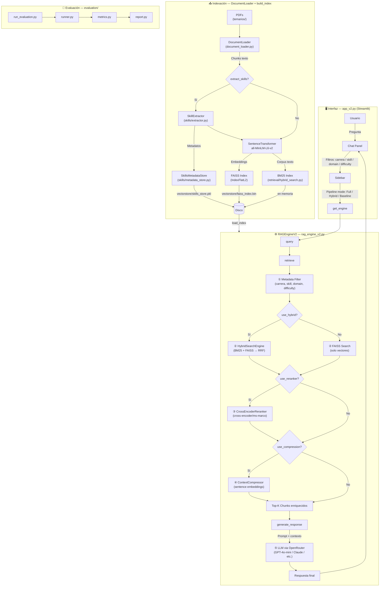

# RAG Temarios Universitarios — v2

Sistema de Retrieval-Augmented Generation (RAG) para consultar planes de estudio
y temarios universitarios mediante lenguaje natural.

La versión 2 incorpora búsqueda híbrida (BM25 + FAISS), re-ranking con cross-encoder,
compresión de contexto y extracción de habilidades por LLM.

---

## Arquitectura del sistema



---

## Descripción de componentes

### `app_v2.py` — Interfaz web (Streamlit)

Punto de entrada de la aplicación. Gestiona el estado de sesión, renderiza la
barra lateral con filtros y el panel de chat. Permite elegir entre tres modos
de pipeline (Full, Hybrid, Baseline) y lanzar la reindexación de documentos
con o sin extracción de habilidades.

### `rag_engine_v2.py` — Motor RAG

Núcleo del sistema. Expone dos operaciones principales:

- **`build_index(chunks)`** — Codifica los chunks con Sentence Transformers,
  construye el índice FAISS y opcionalmente el índice BM25.
- **`query(pregunta, filtros...)`** — Ejecuta el pipeline completo de recuperación
  y generación para cada consulta del usuario.

### `document_loader.py` — Carga de documentos

Lee archivos PDF desde la carpeta `temarios/`, extrae el texto página a página
con PyPDF y lo divide en chunks con solapamiento configurable (`CHUNK_SIZE`,
`CHUNK_OVERLAP`). Infiere el nombre de la carrera a partir del nombre del archivo.

### `retrieval/` — Módulos de recuperación avanzada

| Módulo | Descripción |
|---|---|
| `hybrid_search.py` | Combina BM25 (léxico) y FAISS (semántico) mediante Reciprocal Rank Fusion (RRF) |
| `reranker.py` | Re-ordena los candidatos usando un cross-encoder `ms-marco` (~80 MB, descarga en primer uso) |
| `compressor.py` | Filtra oraciones irrelevantes dentro de cada chunk comparando embeddings con la query |

### `skills/` — Extracción y gestión de habilidades

| Módulo | Descripción |
|---|---|
| `extractor.py` | Llama al LLM para identificar habilidades, dominio y dificultad en cada chunk |
| `metadata_store.py` | Persiste y consulta los metadatos de habilidades; expone filtros por dominio y dificultad |
| `prompts.py` | Plantillas de prompts para la extracción de habilidades |

### `evaluation/` — Framework de evaluación

Permite medir la calidad del sistema con consultas de referencia (`eval_queries.jsonl`).
Calcula métricas de recuperación y generación y produce un reporte.

---

## Pipeline de consulta (paso a paso)

```
Pregunta del usuario
        │
        ▼
① Metadata Filter ──► restringe los índices FAISS permitidos según
                       carrera / skill / domain / difficulty
        │
        ▼
② Retrieval ─────────► BM25 + FAISS → RRF  (o solo FAISS en modo Baseline)
                        fetch_k = top_k × 4 candidatos
        │
        ▼
③ Re-ranking ────────► cross-encoder puntúa cada par (query, chunk)
                        reduce a top_k
        │
        ▼
④ Compresión ────────► conserva solo oraciones relevantes por chunk
                        reduce tokens enviados al LLM
        │
        ▼
⑤ Generación ────────► LLM via OpenRouter con prompt académico en español
        │
        ▼
      Respuesta + fuentes citadas
```

---

## Estructura del proyecto

```
RAG-temarios/
├── app.py                    Interfaz v1 (legacy, solo FAISS)
├── app_v2.py                 Interfaz v2 — punto de entrada recomendado
├── rag_engine.py             Motor RAG v1 (legacy)
├── rag_engine_v2.py          Motor RAG v2 con pipeline completo
├── document_loader.py        Carga y fragmentación de PDFs
├── extract_skills.py         Script CLI para extracción de habilidades
├── run_evaluation.py         Script CLI para evaluación del sistema
├── requirements.txt          Dependencias v1
├── requirements_v2.txt       Dependencias v2 (incluye BM25, cross-encoder)
├── .env.example              Plantilla de variables de entorno
├── temarios/                 PDFs de planes de estudio
│   └── *.pdf
├── vectorstore/              Índices generados (excluido de Git)
│   ├── faiss_index.bin
│   ├── chunks_metadata.pkl
│   └── skills_store.pkl
├── retrieval/
│   ├── hybrid_search.py      BM25 + FAISS con RRF
│   ├── reranker.py           Cross-encoder re-ranking
│   └── compressor.py        Compresión de contexto por oraciones
├── skills/
│   ├── extractor.py          Extracción de habilidades via LLM
│   ├── metadata_store.py     Almacén y filtros de metadatos
│   └── prompts.py            Plantillas de prompts
└── evaluation/
    ├── dataset.py
    ├── eval_queries.jsonl    Consultas de referencia
    ├── metrics.py
    ├── report.py
    └── runner.py
```

---

## Instalación

### Requisitos previos

- Python 3.12 o superior
- Cuenta en OpenRouter: https://openrouter.ai

### 1. Instalar dependencias

```bash
pip install -r requirements_v2.txt
```

La primera ejecución descarga:
- Modelo de embeddings `all-MiniLM-L6-v2` (~90 MB)
- Modelo cross-encoder para re-ranking (~80 MB, solo en primer uso)

### 2. Configurar variables de entorno

```bash
copy .env.example .env
```

Editar `.env` con los valores requeridos:

```env
OPENROUTER_API_KEY=sk-or-v1-...
OPENROUTER_MODEL=openai/gpt-4o-mini
RAG_TOP_K=5
CHUNK_SIZE=1000
CHUNK_OVERLAP=200
```

### 3. Agregar documentos

Copiar los PDFs de temarios en la carpeta `temarios/`. El nombre de la carrera
se infiere automáticamente del nombre del archivo.

### 4. Ejecutar la aplicación

```bash
streamlit run app_v2.py
```

Disponible en: http://localhost:8501

---

## Uso

Al iniciar, el sistema intenta cargar el índice desde `vectorstore/`. Si no existe,
usar el botón **"Reindex documents"** en la barra lateral.

**Modos de pipeline (sidebar):**

| Modo | BM25+FAISS | Re-ranking | Compresión |
|---|:---:|:---:|:---:|
| Full (hybrid + rerank + compress) | ✅ | ✅ | ✅ |
| Hybrid only | ✅ | ❌ | ❌ |
| Baseline (FAISS only) | ❌ | ❌ | ❌ |

**Filtros disponibles:**
- **Carrera** — restringe la búsqueda a un programa académico específico
- **Domain** — filtra por dominio de conocimiento (requiere extracción de skills)
- **Difficulty** — filtra por nivel de dificultad del contenido
- **Skill keyword** — búsqueda por habilidad específica (ej. `linear regression`)

**Ejemplos de consultas:**

- "¿Qué materias de matemáticas incluye Ingeniería en Sistemas?"
- "¿Cuántos semestres dura Administración de Empresas?"
- "Compara las materias de programación entre Sistemas y Ciencia de Datos."
- "¿Qué asignaturas optativas ofrece Actuaria?"

---

## Extracción de habilidades (opcional)

La extracción de habilidades enriquece cada chunk con metadatos estructurados
(habilidades, dominio, dificultad) usando el LLM. Es costosa en tokens pero se
ejecuta solo una vez al indexar.

**Desde la interfaz:** activar el toggle *"Extract skills"* antes de pulsar
*"Reindex documents"*.

**Desde línea de comandos:**

```bash
python extract_skills.py
```

---

## Tecnologías utilizadas

| Componente | Tecnología |
|---|---|
| Interfaz web | Streamlit |
| Modelo de lenguaje | Cualquier LLM via OpenRouter |
| Cliente de API | OpenAI SDK (compatible con OpenRouter) |
| Embeddings | all-MiniLM-L6-v2 (Sentence Transformers) |
| Índice vectorial | FAISS (Facebook AI Similarity Search) |
| Búsqueda léxica | BM25 (rank_bm25) |
| Re-ranking | cross-encoder/ms-marco-MiniLM-L-6-v2 |
| Compresión | Sentence Transformers (cosine similarity) |
| Lectura de PDFs | PyPDF |

---

## Notas técnicas

**Hybrid search (RRF):** La fusión BM25 + FAISS mediante Reciprocal Rank Fusion
combina lo mejor de la búsqueda léxica (coincidencia exacta de términos) con la
búsqueda semántica (significado del texto), mejorando la cobertura de recuperación.

**Cross-encoder re-ranking:** A diferencia del bi-encoder usado para FAISS, el
cross-encoder procesa la query y cada chunk juntos, produciendo scores de relevancia
más precisos. Se aplica sobre los `top_k × 4` candidatos preliminares.

**Compresión de contexto:** Antes de enviar los chunks al LLM, el compresor elimina
oraciones cuyo embedding sea poco similar al de la query. Reduce el uso de tokens
y mejora la calidad de las respuestas al eliminar ruido.

**Persistencia del índice:** El índice FAISS, los metadatos de chunks y el store de
habilidades se guardan en `vectorstore/`. Se cargan en ejecuciones posteriores sin
reprocesar los PDFs. Reconstruir el índice al agregar o modificar documentos.

**Seguridad:** El archivo `.env` contiene la clave de API y no debe subirse al
repositorio. El `.gitignore` incluido ya lo excluye, junto con `vectorstore/`.
